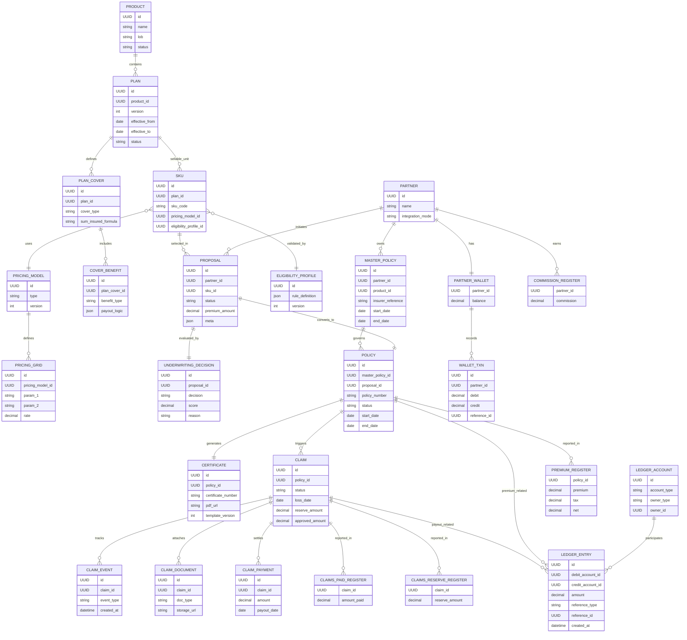

## What is Embedded Insurance?

Embedded insurance is a distribution model where insurance is integrated directly into a primary product or transaction journey — rather than sold separately through agents or aggregators.

**Real-world examples:**

- Device protection offered during mobile checkout
- Loan protection bundled with credit disbursement
- Travel insurance embedded in ticket booking
- Health cover attached to a subscription plan

Unlike traditional agency or bancassurance models, embedded insurance is:

- **Partner-distributed** — e-commerce, fintech, NBFC, and travel platforms sell the product
- **API-driven and real-time** — no manual underwriting delays
- **SKU-based** — sellable units attached to transactions
- **Operated under a Master Policy + Certificate of Insurance (COI) structure**
- **Highly automated** — across issuance, finance, and claims

---

## Key Structural Concepts

Before diving into architecture, these domain concepts are essential:

| Concept | Definition |
|---|---|
| **Master Policy** | A single contract issued to the partner (or aggregator) covering a defined cohort of customers |
| **Certificate of Insurance (COI)** | Individual proof of coverage issued to each insured under the master policy |
| **SKU** | The smallest sellable unit — a versioned plan with specific covers and pricing rules |
| **Cover** | Risk type (e.g., accidental damage, hospitalization, death) |
| **Benefit** | Payout construct within a cover |
| **Underwriting** | Assumed as a black-box service that returns eligibility and pricing modifiers |

---

## Part 1 — Platform Architecture Blueprint

### Product Hierarchy & SKU Design

This is the foundation of configurability. The product engine must support multiple lines of business (LOBs) without LOB-specific code.

```text
Product
  └── Plan (Versioned)
        └── Cover
              └── Benefit
                    └── Configurations
```

**Example SKU:**

```json
{
  "sku_id": "LOAN_PROTECT_V3",
  "lob": "credit_life",
  "covers": [
    {
      "type": "death_cover",
      "sum_insured_formula": "loan_outstanding"
    }
  ],
  "pricing_model": "grid_v2",
  "eligibility_profile": "loan_basic_rules"
}
```

**Design Principles:**

1. **Versioning is mandatory.** Plans must be immutable once published. Never modify live plans — create a new version, soft-deprecate the old one, and maintain backward compatibility.

2. **Partner overlays stay separate.** Partners may require custom pricing, modified eligibility, or commission overrides. Keep overrides in a separate layer from the base product definition:

```text
Base Plan
   +
Partner Override Layer
```

---

### Integrations Layer

Embedded insurance must support multiple integration modes to serve different partner types.

#### API-Based (Real-Time)

Used by e-commerce, fintech lending, BNPL, and wallet integrations.

```text
Partner → Proposal API → Eligibility → Pricing → Issuance → COI
```

Design requirements:
- Idempotency keys on every mutating call
- Versioned APIs
- Async event notifications (webhooks)
- Timeout-safe retry logic

#### POS / SDK Integrations

Used for offline stores and agent-assisted selling:
- Token-based authentication
- Embedded UI SDK with local validation + backend confirmation

#### Offline (SFTP / Batch)

Used by NBFCs and enterprise partners:
- Batch file upload → Validation pipeline → Pricing + Eligibility → Bulk issuance → Reconciliation report
- Must include file checksum validation, row-level error reporting, and reprocessing capability

---

### Pricing Engine (Grid-Based)

Embedded insurance typically uses grid-based pricing rather than actuarial models at runtime.

**Example pricing grid:**

| Age Band | Loan Tenure | Rate |
|---|---|---|
| 18–40 | < 24 months | 0.8% |
| 41–60 | < 24 months | 1.2% |
| 18–40 | > 24 months | 1.1% |

**Resolution flow:**

```text
Pricing Input → Grid Resolver → Rate Selection → Premium Calculator
```

Key considerations:
- Grid versioning (old grids must remain queryable)
- Partner-level overrides
- Preloading grids in memory for performance
- Formula abstraction — no hardcoded logic

---

### Eligibility Engine

Eligibility rules can be static (mandatory field validation), rule-based (config-driven), or underwriting-triggered (external service).

**Example Rule DSL:**

```text
IF loan_amount > 5L THEN reject
IF age > 65 THEN reject
IF pincode IN blacklist THEN reject
```

**Fail strategy:**
- **Fail-closed** — reject if rules are unavailable (preferred for insurance)
- **Fail-open** — allow issuance if non-critical (only with explicit approval)

---

### Failure Handling

Embedded insurance platforms must handle complex failure scenarios gracefully.

| Scenario | Strategy |
|---|---|
| **Payment success, issuance failure** | Compensation workflow → Retry issuance → If irrecoverable, trigger refund + reversal entry |
| **PAS (Policy Admin System) timeout** | Async confirmation → Track `pending_issuance` state → Reconcile via event listener |
| **Duplicate requests** | Idempotency keys + unique proposal reference ID + state-based validation |

---

### Float Balance / Partner Ledger

Two common financial models:

| Model | How It Works |
|---|---|
| **Pre-funded (Float)** | Partner maintains a balance. Debit float → Issue policy |
| **Post-paid Commission** | Insurer settles commission periodically |

**Float ledger design (high-level):**

```text
partner_wallet:     | partner_id | balance |
wallet_transactions: | txn_id | partner_id | debit | credit | reference_id |
```

Settlement cycle: Daily premium collection summary → Commission deduction → Net settlement report.

**The ledger must be immutable.**

---

### Certificate of Insurance (COI)

COI lifecycle:

```text
Policy Issued → Data bound to template → PDF generated → Stored in object storage → URL returned
```

Design requirements:
- Versioned templates with dynamic placeholders
- Template audit trail
- Re-generation capability
- Must reference: master policy number, certificate number, coverage details

---

### Claims System

```text
FNOL → Documents Pending → Assessment → Approved / Rejected → Paid
```

Key data points per claim: Claim ID, Policy reference, Reserve amount, Paid amount, Fraud flags.

**Reserve vs Paid** — Reserve is the expected liability; Paid is the actual settlement. Reserve tracking is critical for regulatory reporting.

---

### Reporting Architecture

Embedded insurance must support both regulatory (IRDAI) and partner reporting.

**Core registers:**

| Register | Key Fields |
|---|---|
| Premium Register | policy_id, premium, tax, net |
| Claims Paid Register | claim_id, amount_paid, payout_date |
| Claims Reserve Register | claim_id, reserve_amount |
| Commission Register | partner_id, commission_amount |

**Architecture:**

```text
Operational DB → Event Stream → Reporting Warehouse → Regulatory / Partner Reports
```

Never run heavy reports on the transactional database.

**IRDAI reporting considerations:** Monthly premium summaries, claim ratio reporting, product-wise data segregation, audit-ready exports.

---

## Part 2 — Domain Model & Entity-Relationship Design

This section maps the architecture into a production-grade domain model, organized by bounded context.

### Bounded Contexts

The platform is organized into 6 isolated contexts:

1. **Product Configuration** — Product, Plan, Cover, Benefit, SKU
2. **Pricing & Eligibility** — Grid models, rule definitions
3. **Policy & Issuance** — Proposal, Underwriting, Policy, Certificate
4. **Claims** — Claim lifecycle, documents, payments
5. **Finance & Ledger** — Double-entry accounts, float wallet
6. **Partner & Overlay** — Partner config, plan overrides

---

### Product & SKU Entities

```text
product
  id            UUID
  name          string
  lob           string     (device / health / credit)
  status        enum       (draft / active / deprecated)

plan
  id            UUID
  product_id    FK(product)
  version       integer
  effective_from date
  effective_to  date
  status        enum       ← Immutable once active

plan_cover
  id            UUID
  plan_id       FK(plan)
  cover_type    string
  sum_insured_formula string

cover_benefit
  id            UUID
  plan_cover_id FK(plan_cover)
  benefit_type  string
  payout_logic  json

sku
  id            UUID
  plan_id       FK(plan)
  sku_code      string
  pricing_model_id FK(pricing_model)
  eligibility_profile_id FK(eligibility_profile)
```

SKU is the **sellable layer** — the unit partners interact with.

---

### Pricing & Eligibility Entities

```text
pricing_model
  id            UUID
  type          enum(grid / formula)
  version       integer

pricing_grid
  id            UUID
  pricing_model_id FK
  param_1       string
  param_2       string
  rate          decimal

eligibility_profile
  id            UUID
  rule_definition json
  version       integer     ← Rules stored as DSL JSON
```

---

### Proposal → Policy Issuance Entities

```text
Proposal → Underwriting Decision → Policy → Certificate
```

```text
proposal
  id            UUID
  partner_id    FK(partner)
  sku_id        FK(sku)
  status        enum(draft / submitted / approved / rejected)
  premium_amount decimal
  meta          json

underwriting_decision
  id            UUID
  proposal_id   FK
  decision      enum(approved / rejected / manual)
  score         decimal
  reason        string

policy
  id            UUID
  master_policy_id FK(master_policy)
  proposal_id   FK
  policy_number string
  status        enum(issued / active / cancelled / expired)
  start_date    date
  end_date      date

certificate
  id            UUID
  policy_id     FK
  certificate_number string
  pdf_url       string
  template_version integer

master_policy
  id            UUID
  insurer_reference string
  partner_id    FK
  product_id    FK
  start_date    date
  end_date      date
```

---

### Claims Entities

```text
Policy → Claim → Claim_Event / Claim_Document / Claim_Payment
```

```text
claim
  id            UUID
  policy_id     FK
  status        enum
  loss_date     date
  reserve_amount decimal
  approved_amount decimal

claim_event
  id            UUID
  claim_id      FK
  event_type    string
  created_at    timestamp

claim_document
  id            UUID
  claim_id      FK
  doc_type      string
  storage_url   string

claim_payment
  id            UUID
  claim_id      FK
  amount        decimal
  payout_date   date
  payment_reference string
```

---

### Finance & Ledger Entities

**This is the most critical section.** Never mix business tables with ledger tables.

```text
ledger_account
  id            UUID
  account_type  enum(premium_receivable, insurer_payable,
                     commission_payable, claims_payable)
  owner_type    enum(system, partner, insurer)
  owner_id      UUID

ledger_entry                    ← IMMUTABLE TABLE
  id            UUID
  debit_account_id  FK
  credit_account_id FK
  amount        decimal
  reference_type enum(policy, claim, refund)
  reference_id  UUID
  created_at    timestamp
```

**Float wallet:**

```text
partner_wallet
  partner_id    UUID
  balance       decimal

wallet_txn
  id            UUID
  partner_id    UUID
  debit         decimal
  credit        decimal
  reference_id  UUID
```

---

### Partner & Overlay Entities

```text
partner
  id            UUID
  name          string
  integration_mode enum(api / pos / batch)

partner_plan_override
  id            UUID
  partner_id    FK
  sku_id        FK
  pricing_override json
  commission_override decimal
```

---

### Full Platform ER Diagram

Below is the complete entity-relationship diagram in Mermaid syntax. You can render it in any Mermaid-compatible tool.



### Relationship Summary

```text
Partner
   └── Master_Policy
         └── Policy
               └── Certificate
               └── Claim → Claim_Payment

Product
   └── Plan
         └── SKU
               └── Proposal → Policy

Policy / Claim → Ledger_Entry
```

---

## Part 3 — End-to-End Issuance Flow

This section moves from static design to **runtime system behavior**. We walk through a complete issuance cycle for a loan protection product using a pre-funded float model.

> **Scenario:** Partner is an NBFC. Product is Loan Protection Insurance. Financial model is pre-funded float. Underwriting is abstracted (assume approval).

### High-Level Flow

```text
Partner → Proposal API → Eligibility → Pricing → Underwriting
    ↓
Policy Issuance
    ↓
Ledger Posting (Premium, Commission, Insurer Payable)
    ↓
COI Generation
    ↓
Event Emission
    ↓
Reporting Pipeline
```

---

### Step 1: Proposal Creation

**API request:**

```json
{
  "partner_id": "NBFC_X",
  "sku_id": "LOAN_PROTECT_V3",
  "insured": {
    "loan_amount": 500000,
    "tenure": 36,
    "age": 32
  },
  "idempotency_key": "loan_12345"
}
```

**System actions:**
1. Validate partner
2. Fetch SKU + plan version
3. Run eligibility rules
4. Resolve pricing grid
5. Call underwriting engine (abstracted)
6. Persist proposal

**Database writes:**

| Table | id | status | premium |
|---|---|---|---|
| proposal | P1 | approved | 4500 |

| Table | proposal_id | decision |
|---|---|---|
| underwriting_decision | P1 | approved |

---

### Step 2: Policy Issuance

Issuance **must be idempotent**. Issuance and ledger posting must occur in a **single atomic transaction** or with event-sourced compensation.

**Database writes:**

| Table | id | proposal_id | status |
|---|---|---|---|
| policy | POL1 | P1 | issued |

| Table | id | policy_id | certificate_no |
|---|---|---|---|
| certificate | C1 | POL1 | CERT_123 |

---

### Step 3: Ledger Posting (Financial Core)

**This is where most naive systems fail.**

Assume: Premium = 4500, Commission = 900, Insurer share = 3600.

**Ledger accounts involved:**

| Account | Owner |
|---|---|
| Premium Receivable | System |
| Insurer Payable | Insurer |
| Partner Commission Payable | Partner |
| Partner Float Wallet | Partner |

**Journal entries (double-entry):**

**Entry 1 — Deduct float:**

```text
Debit:  Partner Float Wallet        4500
Credit: Premium Receivable          4500
```

**Entry 2 — Allocate premium to insurer:**

```text
Debit:  Premium Receivable          4500
Credit: Insurer Payable             3600
Credit: Partner Commission Payable   900
```

All entries are stored in `ledger_entry` — **immutable, append-only**.

---

### Step 4: COI Generation

1. Load template version
2. Bind policy + insured data
3. Generate PDF
4. Store in object storage
5. Update certificate record with `pdf_url`

---

### Step 5: Emit Domain Events

```json
{
  "event_type": "policy_issued",
  "policy_id": "POL1",
  "premium": 4500,
  "commission": 900
}
```

**Event bus consumers:**
- Reporting pipeline
- Settlement service
- Partner webhook notification

---

### Reporting Pipeline

```text
Operational DB → CDC / Event Stream → Reporting Warehouse → IRDAI Reports / Partner Dashboards
```

**Registers generated from this issuance:**

| Register | Key Data |
|---|---|
| Premium Register | POL1, gross: 4500, tax: 0, net: 4500 |
| Commission Register | NBFC_X, POL1, commission: 900 |
| Insurer Payable Report | InsurerA, total: 3600 |
| Float Balance Snapshot | NBFC_X, balance: old - 4500 |

---

### Settlement Cycle (T+1)

At settlement time:

```text
Debit:  Insurer Payable                3600
Credit: Bank Settlement Account        3600

Debit:  Partner Commission Payable      900
Credit: Partner Bank Account            900
```

---

### Claims Impact on Ledger

**When claim is approved (reserve created):**

```text
Debit:  Claims Expense
Credit: Claims Reserve
```

**When claim is paid:**

```text
Debit:  Claims Reserve
Credit: Bank Account
```

Reserve tracking feeds IRDAI reporting directly.

---

## Part 4 — Failure Scenarios & Recovery

### Scenario A: Policy Created, Ledger Fails

Wrap issuance + ledger in a DB transaction, **or** use an event-driven compensation workflow.

If ledger posting fails:
1. Mark policy as `issuance_pending`
2. Retry ledger posting
3. Never leave a policy in `issued` state without corresponding ledger entries

### Scenario B: Ledger Posted, COI Fails

Non-financial failure. Retry COI generation independently. **Never reverse ledger entries for a document generation failure.**

### Scenario C: Float Insufficient

Pre-check before issuance:

```text
IF float_balance < premium THEN reject
```

Or move the partner to a credit-based model.

### Scenario D: Reporting Lag

Reporting must be **eventually consistent**. Never block issuance for a reporting write.

---

## Part 5 — Reconciliation & Data Consistency

### Daily Reconciliation Jobs

Compare across systems:
- Ledger premium total vs. float deductions
- Float deductions vs. insurer payable
- Insurer payable vs. settlement records

Detect breakage: missing ledger entries, duplicate entries, negative balances.

### Production-Grade Guarantees

**Use:**
- Idempotency keys on all mutating APIs
- Unique constraints on proposal references
- Immutable ledger (append-only, no updates)
- Versioned pricing models
- Event replay safety

**Avoid:**
- Updating ledger rows (ever)
- Coupling reporting DB to transactional DB
- Hardcoding commission logic
- Running reports on the operational database

---

## Architectural Observations

| Principle | How It's Achieved |
|---|---|
| **Separation of concerns** | Product config, transactions, ledger, and reporting are isolated bounded contexts |
| **Multi-LOB safe** | No LOB-specific tables — differences handled via JSON fields, cover types, and rule engine |
| **Regulatory ready** | Immutable ledger, audit log, versioned products, reserve tracking |
| **Partner scalable** | Override layer keeps partner customizations decoupled from base product |
| **Failure isolated** | Each subsystem can fail independently without corrupting financial state |
| **Event-driven extensibility** | Domain events decouple issuance from reporting, settlement, and notifications |

---

## Closing Thought

Embedded insurance is not just about attaching a plan to a checkout screen.

It is about building:
- A **configurable product engine** that supports multiple LOBs
- A **reliable issuance pipeline** with idempotency and failure recovery
- A **financially correct ledger** using double-entry accounting
- A **scalable claims workflow** with reserve tracking
- A **compliant reporting backbone** ready for regulatory scrutiny

When designed properly, this becomes a **reusable insurance infrastructure layer** that can support multiple partners, multiple lines of business, multiple distribution models, high transaction scale, and strict regulatory requirements — all without rewriting the core.
